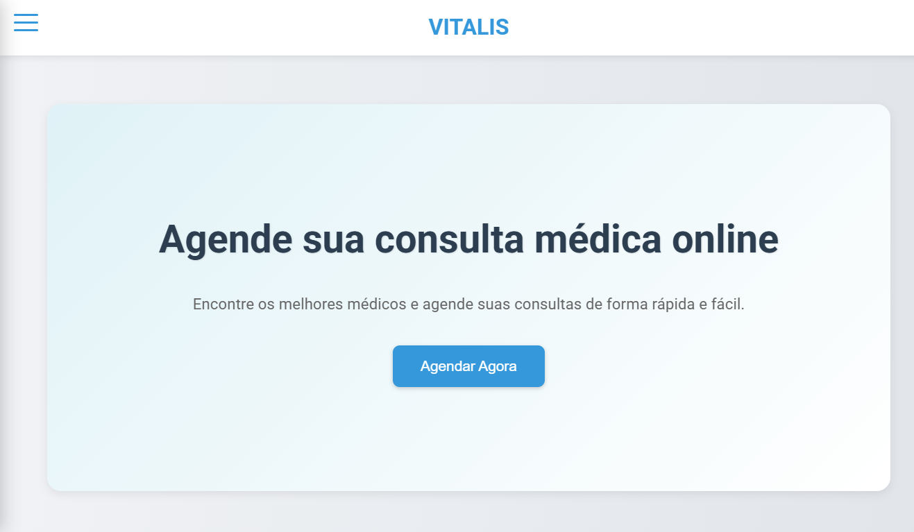
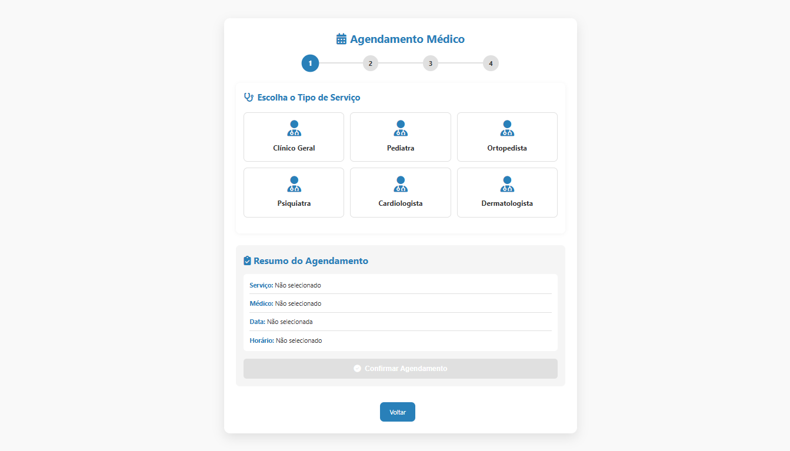
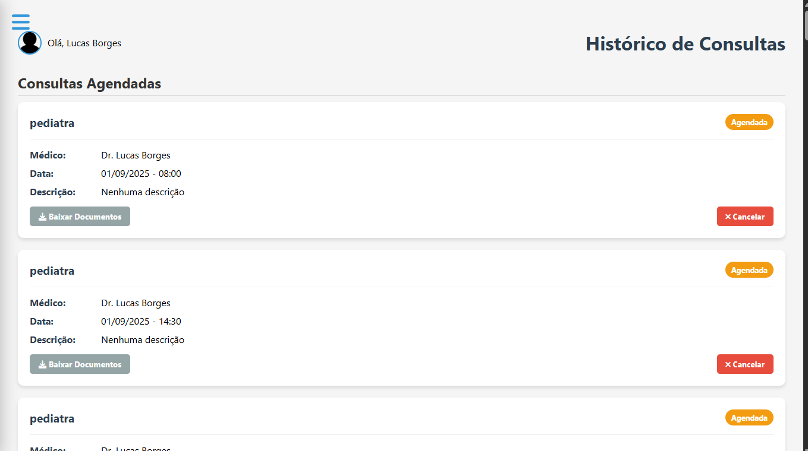
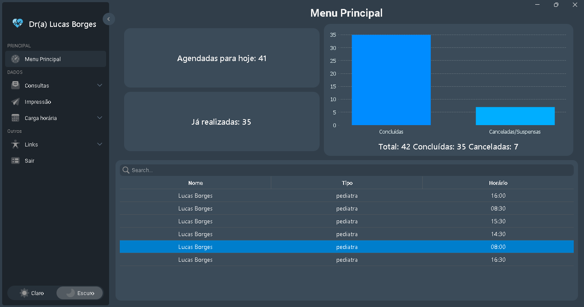
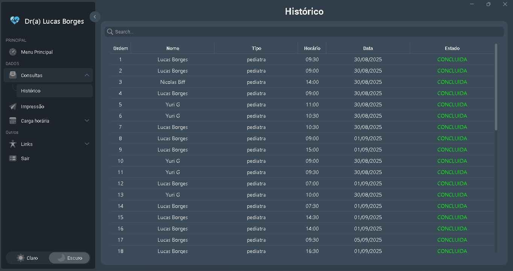
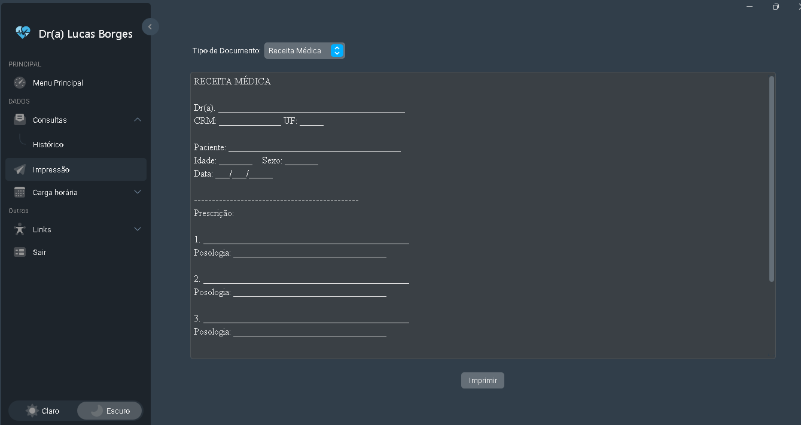
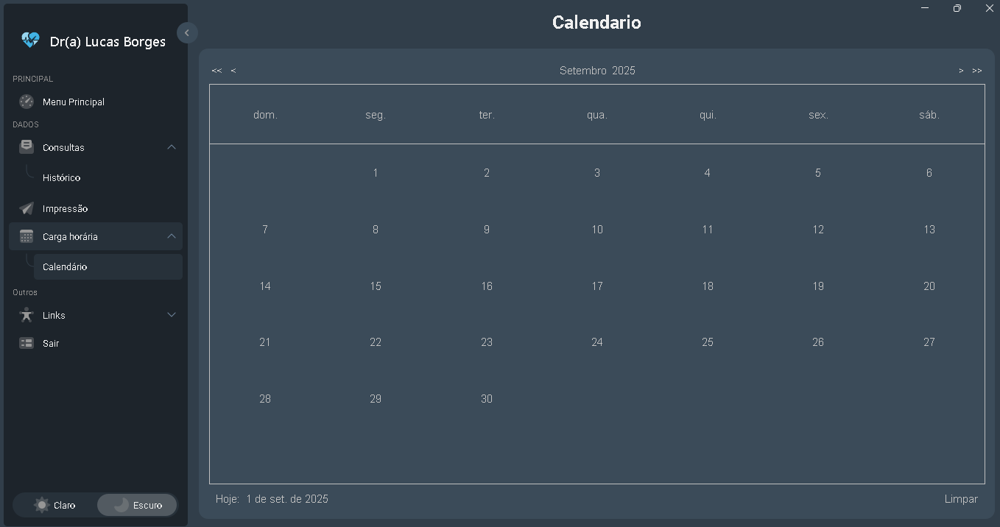
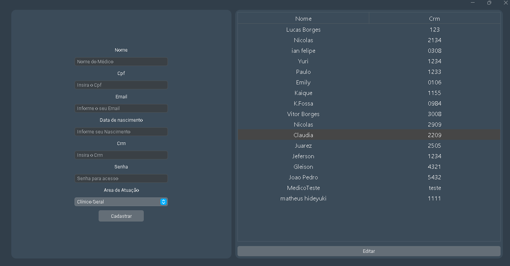

# 🩺 Sistema de agendamento de Consultas Médicas

Este projeto é um sistema  desenvolvido como Trabalho de Conclusão de Curso (TCC), com o objetivo de gerenciar consultas médicas e permitir que os pacientes agendem suas consultas.

---

## 📌 Sobre o Projeto

O **Sistema de agendamento de Consultas Médicas** permite que clínicas, consultórios ou profissionais da área da saúde possam:

- Cadastrar médicos
- Agendar, editar e cancelar consultas
- Visualizar histórico de atendimentos
- Emitir atestados ou receitas


---

## 🧩 Funcionalidades

✅ Cadastro de pacientes  
✅ Cadastro de médicos  
✅ Agendamento de consultas  
✅ Edição e cancelamento de agendamentos  
✅ Emitir atestado ou receita  

---

## 🛠 Tecnologias Utilizadas

| Tecnologia     | Descrição                   |
|----------------|-----------------------------|
| Java           | Linguagem           |
| Python(Django)  | Linguagem            |
| Swing          | Interface gráfica            |
| JDBC           | Conexão com o banco de dados |
| PostgreSQL | Banco de dados relacional    |
| Supabase      | Armazenamento de BD em nuvem  |
| Git            | Controle de versão           |

---

## 📸 Capturas de Tela

## Site





## Aplicativo







---

## 🚀 Como Executar

### Pré-requisitos:
- Java JDK 8 ou superior
- IDE como NetBeans, Eclipse ou IntelliJ
- Vscode
- Banco de dados PostgreSQL
- Git
- Python

```bash

# Clone o repositório
git clone https://github.com/seu-usuario/seu-repo.git

# Acesse o projeto do site no vscode e configure a conexão com o banco por meio do arquivo .env. as instruções de inicialização estão em um documento dentro do projeto.
# A mesma coisa para o aplicativo desktop, abre o projeto na IDE Netbeans e forneca a conexão com o banco de dados.
